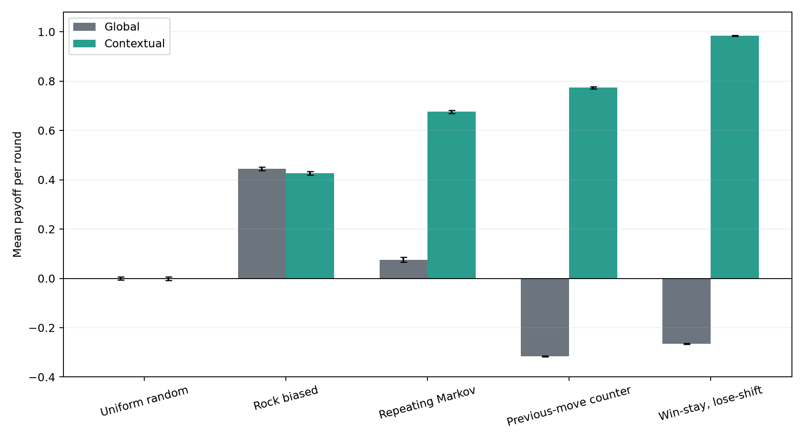
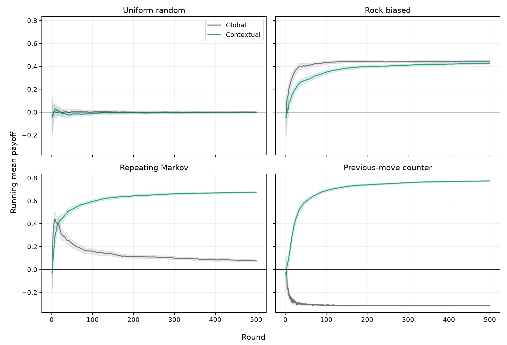

# Experiments: when does context help?

The following experiments compare our markovian model (here referred to as *contextual*) to a *global* Dirichlet model, that doesn't look at the current context to predict the next move.

The contextual model remembers more than the global baseline, but additional
memory is useful only when it captures a real dependency. These experiments
test when conditioning on the previous pair of moves improves prediction and
decision-making, and when it merely divides the available evidence into smaller
samples.

## Experimental setup

Every configuration is evaluated over 100 independent seeds, with 500 rounds
per seed. Both models start from the symmetric
\(\operatorname{Dirichlet}(1,1,1)\) prior and face exactly the same opponent
rules:

- the **global model** estimates one distribution for the opponent's next move;
- the **contextual model** estimates one distribution for each previous pair of
  moves \((M_t,O_t)\).

The principal metric is the mean payoff per round. It lies between \(-1\) and
\(+1\), and zero is the natural baseline. We also record predictive log loss:
lower values indicate better probability forecasts. Error bars and shaded
regions in the figures are 95% normal confidence intervals across seeds.

The complete experiment can be reproduced from the repository root:

```powershell
python experiments/run_experiments.py
```



## Results at a glance

| Opponent | Global payoff | Contextual payoff | Global log loss | Contextual log loss |
|---|---:|---:|---:|---:|
| Uniform random | 0.000 | 0.000 | 1.107 | 1.137 |
| Rock biased | 0.444 | 0.427 | 0.947 | 0.961 |
| Repeating Markov | 0.075 | 0.676 | 1.097 | 0.683 |
| Previous-move counter | -0.316 | 0.774 | 1.109 | 0.544 |
| Win-stay, lose-shift | -0.265 | 0.984 | 1.109 | 0.070 |

Each entry is the mean across the 100 seeds. The unrounded values, standard
deviations, and confidence intervals are saved in
`experiments/results/summary.csv`.

## No pattern to learn

The `uniform-random` opponent chooses each move independently with probability
\(1/3\). Neither its marginal distribution nor the previous round provides a
predictive advantage.

Both models consequently obtain a mean payoff indistinguishable from zero. The
contextual model also spreads its observations over nine separate contexts, so
its probability estimates converge more slowly without gaining useful
information.

!!! success "Message"
    Bayesian learning cannot create information that is absent from the data.

## When pooling data is better

The `rock-biased` opponent plays Rock, Paper, and Scissors with probabilities
\((0.60,0.25,0.15)\), independently of previous rounds. Both models can discover
the preference for Rock and learn to favour Paper.

Here the global model has the right structure: every observation informs the
same three probabilities. The contextual model eventually discovers the same
bias, but must rediscover it separately in each visited context. Its additional
flexibility therefore creates a small sample-efficiency cost.

!!! success "Message"
    When the pattern is global, pooling observations learns it faster.

## When context becomes informative

The `repeating-markov` opponent repeats its previous move with probability
\(0.70\). Its long-run marginal frequencies can look nearly uniform, even
though its next action is strongly predictable from its current one.

The global model cannot represent this dependency. The contextual model can:
the opponent's previous move is part of its context, so it learns the three
conditional repetition patterns and converts them into a substantial payoff.

!!! success "Message"
    Context helps when the variables being remembered match the mechanism that
    generates the next observation.

## Learning a reactive opponent

With probability \(0.80\), the `previous-move-counter` opponent responds with
the move that beats the bot's previous move. This is not merely temporal
dependence: the environment reacts directly to an action selected by the bot.

The global model ignores that interaction and is systematically exploited. The
contextual model conditions on the bot's previous move, anticipates the likely
response, and turns the same interaction into a strong advantage.

!!! success "Message"
    In an interactive system, ignoring how the environment responds to our
    actions can reverse the result.

## How learning develops

The final payoff is only part of the story. The learning curves show the
running mean payoff across the 100 seeds. Early uncertainty is gradually
replaced by stable behaviour, at a rate determined by how well each model
matches the opponent.



The random opponent remains centred on zero. Against the global bias, both
models improve, with a modest advantage from pooling the data. Against the two
context-dependent strategies, the curves separate sharply as the contextual
model collects enough observations in the relevant states.

## A best-case scenario

`win-stay-lose-shift` repeats its move after winning and otherwise advances
cyclically. Given the previous pair of moves, the payoff and therefore the next
move are determined. This rule is almost perfectly aligned with the contextual
model's representation, which eventually predicts and counters it nearly every
round.

This should be read as a best case rather than a general promise. Near-perfect
performance occurs because the chosen context contains all the information
needed to express a deterministic opponent.

## What the experiments tell us

The contextual model is not universally superior. It trades faster estimation
for a richer representation: nine conditional distributions instead of one.
That trade is favourable only when the extra variables contain predictive
information.

> The best model is not the one that remembers the most, but the one that
> remembers what matters.


!!! question "How do the models perform against a human opponent?"
    Try it out!