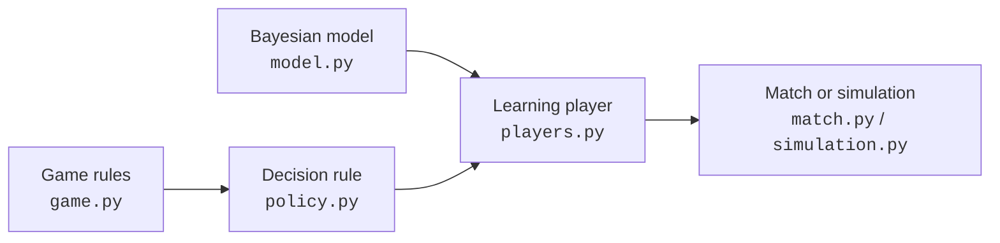
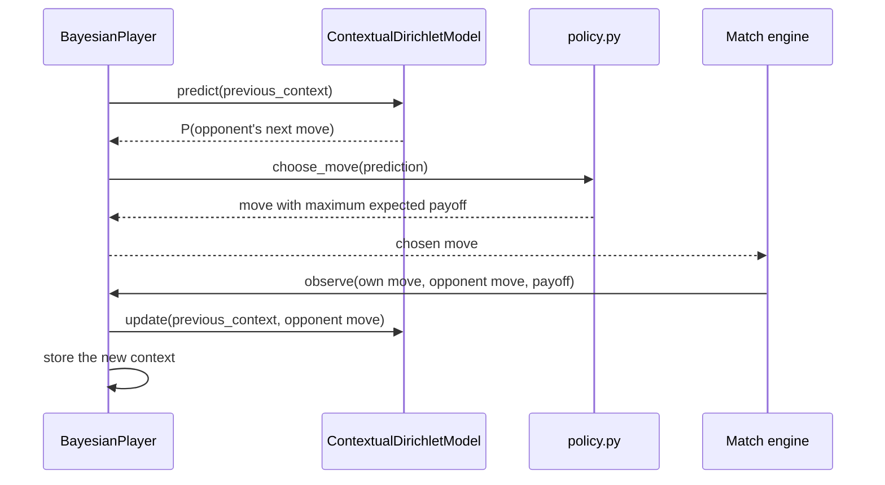

# From the model to the code

<!-- 
The mathematical model can be read as a short loop: use the previous round as
the current context, predict the opponent's next move, choose the action with
the largest expected payoff, and finally update the model with the move that
was observed. The implementation keeps these responsibilities separate.


-->

## Moves and payoffs

The mathematical ordering \((R,P,S)\) is represented by the integer values
`0`, `1`, and `2` in `game.py`:

```python title="game.py"
class Move(IntEnum):
    ROCK = 0
    PAPER = 1
    SCISSORS = 2

MOVES = tuple(Move)
```

A move can be used directly as an array index throughout the program. 
Consequently, the payoff matrix in the code is a literal transcription of \((g_{ij})\):

```python title="game.py"
PAYOFF_MATRIX = (
    (0, -1, 1),
    (1, 0, -1),
    (-1, 1, 0),
)
```

`PAYOFF_MATRIX[our_move][opponent_move]` therefore returns \(g_{ij}\), with
the bot's move selecting a row and the opponent's move selecting a column.

## The nine contexts and their counts

In `model.py`, a context is the pair of moves from the previous round:

```python title="model.py"
Context = Tuple[Move, Move]
```

The first entry is our previous move and the second is the opponent's previous
move. The model stores the observed transition counts in a
\(3\times3\times3\) array:

```python title="model.py"
self.counts = [[[0 for _ in MOVES] for _ in MOVES] for _ in MOVES]
```

Its entry

```python title="model.py"
self.counts[our_previous][opponent_previous][observed_move]
```

is exactly \(n_{c,j}\): the number of times move \(j\) followed context
\(c=(M_t,O_t)\). The first two indices select one of the nine contexts, while
the last index selects Rock, Paper, or Scissors.

!!! question "Why are there 27 counts?"
    There are nine possible contexts and three possible outcomes after each
    context. The model therefore stores \(9\times3=27\) counts, but learns nine
    probability distributions.

## From counts to a prediction

`ContextualDirichletModel.predict` implements the posterior predictive formula
directly:

```python title="model.py"
observations = self.counts[our_previous][opponent_previous]
posterior = [prior + count for prior, count in zip(self.alpha, observations)]
total = sum(posterior)
return tuple(value / total for value in posterior)
```

For the selected context, `observations` is
\((n_{c,R},n_{c,P},n_{c,S})\). Adding it to `alpha` produces the posterior
parameters

\[
(\alpha_R+n_{c,R},\alpha_P+n_{c,P},\alpha_S+n_{c,S}).
\]

Normalising this vector gives

\[
P(O_{t+1}=j\mid C_t=c,\mathbf n_c)
=\frac{\alpha_j+n_{c,j}}
{\sum_k(\alpha_k+n_{c,k})},
\]

so no sampling or numerical integration is needed. With the default
`alpha=(1.0, 1.0, 1.0)`, an unseen context produces the uniform prediction
\((1/3,1/3,1/3)\).

Once the next opponent move is known, `update` performs the conjugate Bayesian
update by incrementing just one count:

```python title="model.py"
self.counts[our_previous][opponent_previous][observed_move] += 1
```

The prior is not modified. The posterior parameters are reconstructed as
`alpha + counts` whenever a prediction is requested.

## From a prediction to an action

The Bayesian model predicts the opponent; it does not itself decide what the
bot should play. That second responsibility belongs to `policy.py`.

```python title="policy.py"
def expected_utilities(prediction):
    return tuple(
        sum(PAYOFF_MATRIX[action][opponent] * prediction[opponent]
            for opponent in MOVES)
        for action in MOVES
    )
```

For every possible action, this computes

\[
U(M)=\sum_j g_{Mj}P(O_{t+1}=j\mid C_t=c,\mathbf n_c).
\]

`choose_move` then finds the maximum utility. If several moves have the same
value, it chooses uniformly among them instead of introducing an arbitrary
preference for the first move in the list.

```python  title="policy.py"
utilities = expected_utilities(prediction)
best_value = max(utilities)
best_moves = [move for move in MOVES if utilities[move] == best_value]
return rng.choice(best_moves)
```

This random tie-breaking matters at the beginning of a match: under the
symmetric prior, all three actions have expected payoff zero.

## The online learning cycle

`BayesianPlayer` in `players.py` connects the model and the decision rule. Its
`_previous_context` variable stores \(C_t=(M_t,O_t)\) between rounds.



There is no previous context before the first round, so the player uses the
normalised prior and postpones the first update until a complete transition has
been observed.

## Running and evaluating the model

The same learning cycle appears in two higher-level components:

- `match.py` is a neutral game engine. It requests both players' moves before
  revealing either one, computes the payoff, and lets both players observe the
  round.
- `simulation.py` runs controlled experiments against the strategies in
  `opponents.py`. It records predictions, expected payoffs, realised payoffs,
  and log loss for every round.

The realised payoff measures decision quality, whereas log loss measures the
quality of the complete predictive distribution:

\[
\operatorname{LogLoss}_{t+1}
=-\log P(O_{t+1}\mid C_t,\mathbf n_{C_t}).
\]

This distinction is useful because a bot can occasionally choose the right
counter-move despite having a poorly calibrated prediction, or predict well
without gaining much against an intrinsically random opponent.

Finally, `GlobalDirichletModel` provides a baseline. It uses the same prior,
posterior update, and prediction formula, but deliberately ignores the context
and maintains only three counts. Comparing it with `ContextualDirichletModel`
tests the central modelling assumption: whether the previous pair of moves
really contains useful information about the opponent's next action.

## The complete correspondence

| Mathematical object | Meaning | Code |
|---|---|---|
| \(M_t,O_t\) | Moves played at round \(t\) | `Move` in `game.py` |
| \(C_t=(M_t,O_t)\) | Previous-round context | `Context` in `model.py` |
| \(n_{c,j}\) | Transitions from context \(c\) to move \(j\) | `ContextualDirichletModel.counts` |
| \(\boldsymbol\alpha\) | Dirichlet pseudocounts | `ContextualDirichletModel.alpha` |
| \(P(O_{t+1}\mid C_t)\) | Posterior predictive distribution | `predict` in `model.py` |
| \(g_{ij}\) | Payoff of action \(i\) against move \(j\) | `PAYOFF_MATRIX` in `game.py` |
| \(U(M)\) | Expected payoff of a candidate move | `expected_utilities` in `policy.py` |
| \(M^*\) | Utility-maximising move | `choose_move` in `policy.py` |
| Sequential update | Predict, act, observe, learn | `BayesianPlayer` in `players.py` |

