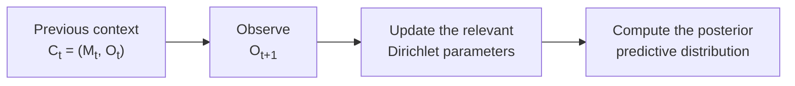

# The Bayesian Model

We effectively model the game as a Markovian process, where the next move is selected based on the current context.
Since each player has three possible moves, there are nine possible contexts:

\[
\begin{array}{}
(R,R), (R,P), (R,S),\\
(P,R), (P,P), (P,S),\\
(S,R), (S,P), (S,S).
\end{array}
\]

For each context, the bot learns a separate probability distribution over the
opponent's next move. Given a context $c$, we represent the distribution through the vector

\[
\boldsymbol{\theta}_c =
(\theta_{c,R}, \theta_{c,P}, \theta_{c,S}),
\]

where, for example,

\[
\theta_{c,R} = P(O_{t+1}=R \mid C_t=c).
\]

The nine vectors $\boldsymbol\theta_c$ must be learnt from the data.

## A multinomial likelihood

For each context \(c\), the observed data consists of the counts

\[
\mathbf{n}_c =
(n_{c,R}, n_{c,P}, n_{c,S}),
\]

where \(n_{c,R}\), for example, is the number of times the opponent played Rock
immediately after context \(c\).
Let

\[
N_c = n_{c,R} + n_{c,P} + n_{c,S}
\]

be the total number of transitions observed from context \(c\). Conditional on
the unknown probability vector \(\boldsymbol{\theta}_c\), these counts follow a
multinomial distribution:

\[
\mathbf{n}_c \mid \boldsymbol{\theta}_c
\sim
\operatorname{Multinomial}
\left(N_c,\boldsymbol{\theta}_c\right).
\]

Its probability mass function is

\[
P(\mathbf{n}_c \mid \boldsymbol{\theta}_c)
=
\frac{N_c!}
{n_{c,R}!n_{c,P}!n_{c,S}!}
\theta_{c,R}^{n_{c,R}}
\theta_{c,P}^{n_{c,P}}
\theta_{c,S}^{n_{c,S}}.
\]

When considered as a function of
\(\boldsymbol{\theta}_c\), the likelihood is proportional to

\[
\mathcal{L}(\boldsymbol{\theta}_c)
\propto
\theta_{c,R}^{n_{c,R}}
\theta_{c,P}^{n_{c,P}}
\theta_{c,S}^{n_{c,S}}.
\]

## The conjugate prior

Before observing any transitions, we assign a Dirichlet prior:

\[
\boldsymbol{\theta}_c
\sim
\operatorname{Dirichlet}
(\alpha_R,\alpha_P,\alpha_S).
\]

The density of this distribution is

\[
p(\boldsymbol{\theta}_c)
=
\frac{1}{B(\boldsymbol{\alpha})}
\theta_{c,R}^{\alpha_R-1}
\theta_{c,P}^{\alpha_P-1}
\theta_{c,S}^{\alpha_S-1},
\]

where

\[
\boldsymbol{\alpha}
=
(\alpha_R,\alpha_P,\alpha_S)
\]

and \(B(\boldsymbol{\alpha})\) is the multivariate beta function.

In this project, we initially use the symmetric prior

\[
\boldsymbol{\theta}_c
\sim
\operatorname{Dirichlet}(1,1,1),
\]

which clearly assigns the same initial weight to all three moves. Before observing
any relevant data, its expected probabilities are therefore

\[
E[\boldsymbol{\theta}_c]
=
\left(\frac{1}{3},\frac{1}{3},\frac{1}{3}\right).
\]

!!! note "Interpreting the prior parameters"
    The parameters \(\alpha_R,\alpha_P,\alpha_S\) can be interpreted as
    pseudocounts. A larger value represents a stronger prior belief and makes
    the model react more slowly to new observations.

## Posterior distribution

The Dirichlet distribution is conjugate to the multinomial likelihood.
This means that the posterior belongs to the same family.

Using Bayes' rule,

\[
p(\boldsymbol{\theta}_c \mid \mathbf{n}_c)
\propto
p(\mathbf{n}_c \mid \boldsymbol{\theta}_c)
p(\boldsymbol{\theta}_c).
\]

Substituting the likelihood and prior gives

\[
p(\boldsymbol{\theta}_c \mid \mathbf{n}_c)
\propto
\prod_{j \in \{R,P,S\}}
\theta_{c,j}^{n_{c,j}}
\theta_{c,j}^{\alpha_j-1}.
\]

Combining the exponents,

\[
p(\boldsymbol{\theta}_c \mid \mathbf{n}_c)
\propto
\prod_{j \in \{R,P,S\}}
\theta_{c,j}^{\alpha_j+n_{c,j}-1}.
\]

Therefore,

\[
\boxed{
\boldsymbol{\theta}_c \mid \mathbf{n}_c
\sim
\operatorname{Dirichlet}
\left(
\alpha_R+n_{c,R},
\alpha_P+n_{c,P},
\alpha_S+n_{c,S}
\right)
}
\]

The update is particularly simple: whenever a new move is observed, the bot
increments the corresponding count for the current context.

!!! note "Interpreting the prior parameters"
    This result clarifies the previous note on interpreting the parameters $\boldsymbol\alpha$ as pseudocounts: counting more occurrences just adds to the prior pseudocounts, eventually leading to the posterior being dominated by the data.

!!! example

    For example, if the prior is

    \[
    \operatorname{Dirichlet}(1,1,1)
    \]

    and the observed counts are

    \[
    \mathbf{n}_c=(2,5,0),
    \]

    then the posterior is

    \[
    \boldsymbol{\theta}_c \mid \mathbf{n}_c
    \sim
    \operatorname{Dirichlet}(3,6,1).
    \]

    

## Posterior predictive distribution

The posterior describes our uncertainty about the unknown vector
\(\boldsymbol{\theta}_c\). To play the game, however, we need the probability of
the opponent's next move.

The posterior predictive probability is obtained by integrating over all
possible values of \(\boldsymbol{\theta}_c\):

\[
    \begin{align}
P(O_{t+1}=j \mid C_t=c,\mathbf{n}_c)
&=
\int
P(O_{t+1}=j \mid \boldsymbol{\theta}_c)
p(\boldsymbol{\theta}_c \mid \mathbf{n}_c)
\,d\boldsymbol{\theta}_c\\
&=\int \theta_{c,j}\ p(\boldsymbol\theta_c|\mathbf n_c)\,d\boldsymbol\theta_c.
\end{align}
\]

This is the posterior mean of \(\theta_{c,j}\). For the Dirichlet posterior, this integral has the closed-form solution

\[
\boxed{
P(O_{t+1}=j \mid C_t=c,\mathbf{n}_c)
=
\frac{\alpha_j+n_{c,j}}
{\alpha_R+\alpha_P+\alpha_S+N_c}
}
\]

!!! note
    The bot does not predict the opponent's next move with certainty. It
    maintains a complete probability distribution and updates that distribution
    after every observed round.
    The resulting recipe only uses sums and divisions of the initial parameters and the observed counts, allowing a very simple implementation and an easy update schedule.

!!! example
    For the previous example, the posterior parameters are \((3,6,1)\), so

    \[
    P(O_{t+1}=R \mid C_t=c,\mathbf n_c)=\frac{3}{10}=0.3,
    \]

    \[
    P(O_{t+1}=P \mid C_t=c,\mathbf n_c)=\frac{6}{10}=0.6,
    \]

    and

    \[
    P(O_{t+1}=S \mid C_t=c,\mathbf n_c)=\frac{1}{10}=0.1.
    \]

    Thus, the bot predicts Paper as the most likely next move, while still assigning
    positive probability to Rock and Scissors.

Schematically, the learning process can be represented as follows:

## The decision process

Given the posterior predictive distribution, the bot wants to act in order to maximize the expected payoff. Defining the payoff matrix as 

\[
    (g_{ij}) = \begin{pmatrix}
    0&-1&1\\
    1&0&-1\\
    -1&1&0
    \end{pmatrix},
\]

where the ordering of the entries is R,P,S, we can define, for each possible next move $M$, the expected payoff

\[
    U(M) = \sum_j g_{Mj} P(O_{t+1}=j \mid C_t = c, \mathbf n_c).
\]

The best move to choose is, thus, the one that maximizes \(U\):

\[
M^*=\arg\max_M U(M).
\]
